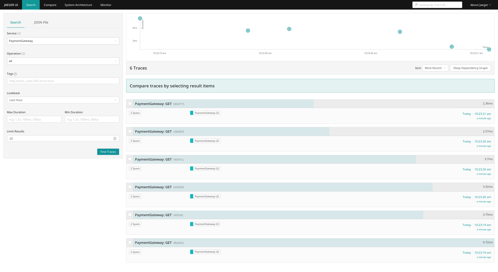

# Elasticsearch
## Start
```
docker-compose up elastic
```

## Generate enrollment token for Kibana
```
docker exec -it elastic bin/./elasticsearch-create-enrollment-token -s kibana
```


# Kibana
## Start
```
docker-compose up kibana
```

## Install APM Integration
- Visit http://localhost:5601/app/integrations/detail/apm/overview -> Add Elastic APM
- Check APM Server Status -> http://localhost:5601/app/home#/tutorial/apm 


# APM
## Start
```
docker-compose up apm
```

# Jaeger
## Start
```
docker-compose up jaeger
```
**Note**: If there is error related to certificate, may you need to change elastic host ip/domain.

## Create index template
- jaeger-service
```
curl -XPUT "https://localhost:9200/_index_template/jaeger-service" -u elastic:elastic -H 'Content-Type: application/json' -d'{
  "priority": 1,
  "template": {
    "settings": {
      "index": {
        "mapping": {
          "nested_fields": {
            "limit": "50"
          }
        },
        "requests": {
          "cache": {
            "enable": "true"
          }
        },
        "number_of_shards": "6",
        "number_of_replicas": "1"
      }
    },
    "mappings": {
      "_routing": {
        "required": false
      },
      "numeric_detection": false,
      "dynamic_date_formats": [
        "strict_date_optional_time",
        "yyyy/MM/dd HH:mm:ss Z||yyyy/MM/dd Z"
      ],
      "_source": {
        "excludes": [],
        "includes": [],
        "enabled": true
      },
      "dynamic": true,
      "dynamic_templates": [
        {
          "span_tags_map": {
            "path_match": "tag.*",
            "mapping": {
              "ignore_above": 256,
              "type": "keyword"
            }
          }
        },
        {
          "process_tags_map": {
            "path_match": "process.tag.*",
            "mapping": {
              "ignore_above": 256,
              "type": "keyword"
            }
          }
        }
      ],
      "date_detection": true,
      "properties": {
        "operationName": {
          "type": "keyword"
        },
        "serviceName": {
          "type": "keyword"
        }
      }
    }
  },
  "index_patterns": [
    "*jaeger-service-*"
  ],
  "composed_of": []
}' --insecure
```

- jaeger-span
```
curl -XPUT "https://localhost:9200/_index_template/jaeger-span" -u elastic:elastic -H 'Content-Type: application/json' -d'{
  "priority": 2,
  "template": {
    "settings": {
      "index": {
        "mapping": {
          "nested_fields": {
            "limit": "50"
          }
        },
        "requests": {
          "cache": {
            "enable": "true"
          }
        },
        "number_of_shards": "6",
        "number_of_replicas": "1"
      }
    },
    "mappings": {
      "_routing": {
        "required": false
      },
      "numeric_detection": false,
      "dynamic_date_formats": [
        "strict_date_optional_time",
        "yyyy/MM/dd HH:mm:ss Z||yyyy/MM/dd Z"
      ],
      "dynamic": true,
      "_source": {
        "excludes": [],
        "includes": [],
        "enabled": true
      },
      "dynamic_templates": [
        {
          "span_tags_map": {
            "path_match": "tag.*",
            "mapping": {
              "ignore_above": 256,
              "type": "keyword"
            }
          }
        },
        {
          "process_tags_map": {
            "path_match": "process.tag.*",
            "mapping": {
              "ignore_above": 256,
              "type": "keyword"
            }
          }
        }
      ],
      "date_detection": true,
      "properties": {
        "traceID": {
          "type": "keyword"
        },
        "process": {
          "type": "object",
          "properties": {
            "tag": {
              "type": "object"
            },
            "serviceName": {
              "type": "keyword"
            },
            "tags": {
              "type": "nested",
              "properties": {
                "tagType": {
                  "type": "keyword"
                },
                "value": {
                  "type": "keyword"
                },
                "key": {
                  "type": "keyword"
                }
              }
            }
          }
        },
        "references": {
          "type": "nested",
          "properties": {
            "spanID": {
              "type": "keyword"
            },
            "traceID": {
              "type": "keyword"
            },
            "refType": {
              "type": "keyword"
            }
          }
        },
        "startTimeMillis": {
          "type": "date"
        },
        "flags": {
          "type": "integer"
        },
        "operationName": {
          "type": "keyword"
        },
        "parentSpanID": {
          "type": "keyword"
        },
        "tags": {
          "type": "nested",
          "properties": {
            "tagType": {
              "type": "keyword"
            },
            "value": {
              "type": "keyword"
            },
            "key": {
              "type": "keyword"
            }
          }
        },
        "duration": {
          "type": "long"
        },
        "spanID": {
          "type": "keyword"
        },
        "startTime": {
          "type": "long"
        },
        "tag": {
          "type": "object",
          "properties": {}
        },
        "logs": {
          "type": "nested",
          "properties": {
            "fields": {
              "type": "nested",
              "properties": {
                "tagType": {
                  "type": "keyword"
                },
                "value": {
                  "type": "keyword"
                },
                "key": {
                  "type": "keyword"
                }
              }
            },
            "timestamp": {
              "type": "long"
            }
          }
        }
      }
    }
  },
  "index_patterns": [
    "*jaeger-span-*"
  ],
  "composed_of": []
}' --insecure
```

## Delete index
Deleting index is required after wrongly create the index template
- Visit http://localhost:5601/app/management/data/index_management/indices 
- delete both **jaeger-service-yyyy-mm-dd** and **jaeger-span-yyyy-mm-dd**.


# Demo
- Start Project, Request to any end point and wait awhile for data to send to Elastic
- Check result at: 
  - http://localhost:5601/app/apm/services
  - http://localhost:16686/search

## Sample Result 
- Elastic APM


- Jaeger


